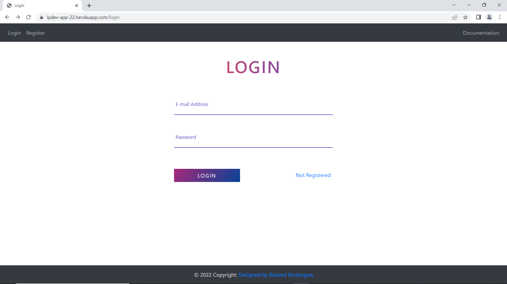

# Location Review Test

## Setup & Installation

Make sure you have the latest version of Python installed.

```bash
git clone <repo-url>
```

```bash
pip install -r requirements.txt
```

## Running The App

```bash
python wsgi.py
```

## Viewing The App

Go to `http://127.0.0.1:5000` or visit the live system hosted on `https://ipdev-app-22.herokuapp.com/home`

## Application Features
### 1. Sign Up

### 2. Login

### 3. Enter an Ip Address to search

### 4. View Visualizations


# Frameworks and technologies used:
## -Front-End
#### 1. Flask
    I used  because of its integrated support, built-in development server, quick debugger, and restful request routing allowing for unit testing in web development. Also It's light enough to quickly transition into a web framework with some extensions.
#### 2. HTML & CSS
## -Back-End
#### Python
## -Visualizations
#### Plotly & Dash
## -Database
#### Mongo DB
